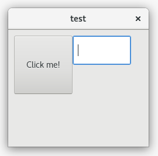

# GUI Builder
This project should help programmers jumpstart their GUI application programming.

* An easy to use platform where you can click and drag, resize, and reconfigure widgets on a window.
* The platform should be able to build into Rust code, using any widget based Crate. (winapi, gtk, etc)
* This starting Rust code should provide example event handling functionality to the user from each Crate.

## Progress Pics

## Why?
GUI programming is generally considered a *hard* task, especially for a beginner programmer.

Without some kind of GUI tool, it is difficult to manage the exact positions of all of the widgets on the screen. Managing each object is a hassle in code.

The target audience is a UI designer who wants to quickly build a fast cross-compatible widget-based application.

The output Rust code is meant to act as a learning experience for the user, teaching them how to use each Crate.

## Limits of development
* The GUI Builder will not attempt to build into multiple Crates at the same time for cross compatibility.

Instead, the GUI Builder will provide support for all Crates independently.

The hope is that eventually someone will build a cross-platform Crate, that the GUI Builder would build into.

* The GUI Builder will not have standardized functions for building widgets.

We should not be abstracting away a Crate's insides for the user's convenience.

If a crate is inconvenient to use, that should not be hidden from the user.

We are exposing the guts of each Crate, and letting the user decide which is best for them.

## How can I help?

This is going to be a long project. There is plenty you can do to help.

### Part A - Complete
Write Rust code that creates an example window, with a few widgets in a few Crates.

For each Crate, provide example hooks into widget specific event handlers.

### Part B - In Progress
Write up a HTML / Javascript "portal" that allows the user to build "widgets" on a "window".

The "windows" and "widgets" here would just be drawings of the real thing.

You should be able to switch "views" to see how the application will look like in each Crate.

When you click on any widget, a dialog appears, that allows the user to change any properties of the widget, like label, font, and color.

The user should be able to click and drag, resize, create, delete any widget.

### Part C - Complete
Figure out some way to Save and Open projects in the HTML portal.

This should keep all configuration data about all widgets on the window.

### Part D - In Progress
Make the HTML portal have a "Build" button that generates all of the Rust code required to build the widgets for the chosen Crate.

Example event handling should be exposed to the user.

The GUI builder will provide starter GUI code.

This should be considered a learning experience, for the user, to figure out which Crate is best for them.

### Part E
Release this code to the public and get feedback.

Find out what people want more of:

* More Crate support?
* More widgets?
* Bug fixes.
* What else?

Make changes based on feedback.
