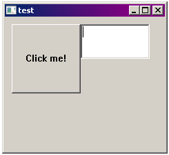

# Visual Rust
This is going to be a *long* project...

I want to build the "Visual Basic" of Rust:

* An easy to use platform where you can click and drag, resize, and reconfigure widgets on a window.
* This window should be able to compile into Rust code, cross-compatible in Windows, Mac, and Linux.
* The widgets (buttons, text boxes, etc), when compiled, should be created with the Operating System's native libraries.
* All of the widgets should have programmable event handlers, all written in Rust.

### [Why?](read/why.md)

### [How?](read/how.md)

### Progress Pics

